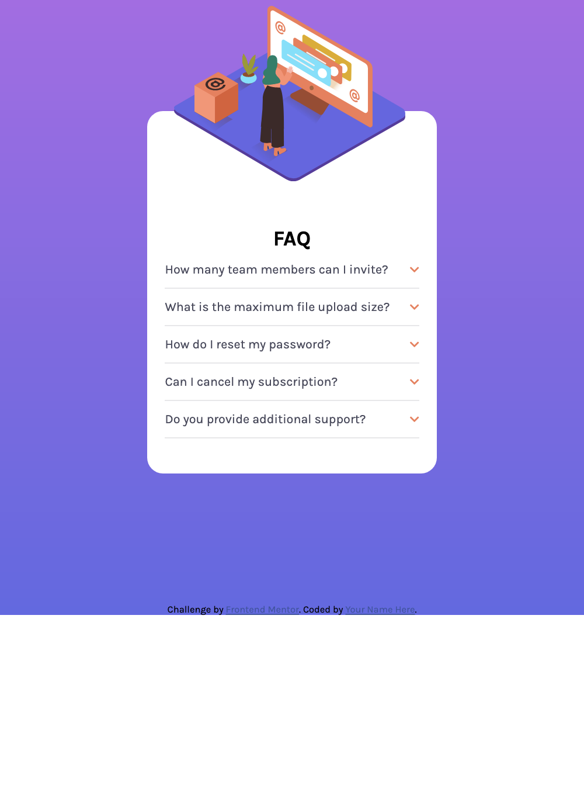
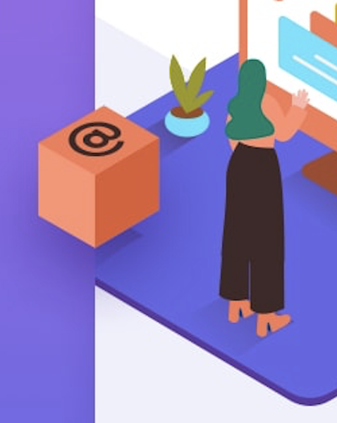

# Frontend Mentor - FAQ accordion card solution

This is a solution to the [FAQ accordion card challenge on Frontend Mentor](https://www.frontendmentor.io/challenges/faq-accordion-card-XlyjD0Oam).

## Table of contents

- [Frontend Mentor - FAQ accordion card solution](#frontend-mentor---faq-accordion-card-solution)
  - [Table of contents](#table-of-contents)
  - [Overview](#overview)
    - [The challenge](#the-challenge)
  - [My process](#my-process)
    - [Built with](#built-with)
    - [What I learned](#what-i-learned)
      - [accordion layout](#accordion-layout)
      - [将自己的 stylesheet 放在最后](#将自己的-stylesheet-放在最后)
      - [渐变色背景](#渐变色背景)
      - [responsive images](#responsive-images)
      - [利用 flex 实现一中一下布局](#利用-flex-实现一中一下布局)
      - [其他](#其他)
    - [Continued development](#continued-development)
    - [Useful resources](#useful-resources)

## Overview

### The challenge

Users should be able to:

- View the optimal layout for the component depending on their device's screen size
- See hover states for all interactive elements on the page
- Hide/Show the answer to a question when the question is clicked

## My process

### Built with

- Semantic HTML5 markup
- CSS custom properties
- Flexbox

### What I learned

#### accordion layout

[简化版](https://codepen.io/effycoco/pen/BawKQme)
控制展开与否的 class 加在标题上而不是装标题+内容的容器上，效果是点击标题控制开关，点击内容不会误关。

#### 将自己的 stylesheet 放在最后

否则容易被 fontawesome 等第三方库改写，选择器同等优先级下会使用放在最后的文件里的 style

#### 渐变色背景

参见[笔记](https://www.notion.so/Cha-11-backgrounds-shadows-and-blend-modes-f29036d69f424100a83ece43f84bb2f7)中的 issues

#### responsive images

mobile 和 desktop design 使用不同的图片如何处理？
通过 picture 内添加多个 source 实现手机和桌面用不同的图片，`img`作后备方案。

```html
<picture>
  <source media="(max-width: 799px)" srcset="elva-480w-close-portrait.jpg" />
  <source media="(min-width: 800px)" srcset="elva-800w.jpg" />
  
</picture>
```

#### 利用 flex 实现一中一下布局

在 flex 中想使用`justify-self`的情况通常可以利用 auto margins 实现

#### 其他

1. body 高度是被内容撑开的，如果内容高度小于浏览器窗口高度，给 body 添加背景色会导致底下一截空白
   解决：
   ```css
   html {
     height: 100vh;
   }
   body {
     height: 100vh;
   }
   ```
2. 如何实现同一容器里的两个图片一个溢出隐藏，一个溢出可见？
   

### Continued development

css:
desktop-design 中的图片布局现在有点乱，~~其 containing block 是最外面的 container, 打算将 img-container 设为`position:relative`从而成为其 containing block,~~ 目前是试出来的，并且是个图片无法整体移动，有没有办法先调整好三个图片的相对位置，再调整整体的位置

js：

- 目前仅仅是点一下展开，再点一下关闭，通过 toggle "active" class 实现
- 以后可以添加的特性：
  - 点一下展开自身的同时关闭其他
  - 点卡片外部关闭所有

### Useful resources

- [如何让元素水平垂直居中](https://github.com/qianguyihao/Web/blob/master/03-CSS%E8%BF%9B%E9%98%B6/04-%E5%A6%82%E4%BD%95%E8%AE%A9%E4%B8%80%E4%B8%AA%E5%85%83%E7%B4%A0%E6%B0%B4%E5%B9%B3%E5%9E%82%E7%9B%B4%E5%B1%85%E4%B8%AD%EF%BC%9F.md)
- [响应式图片剖析](https://jakearchibald.com/2015/anatomy-of-responsive-images/)
